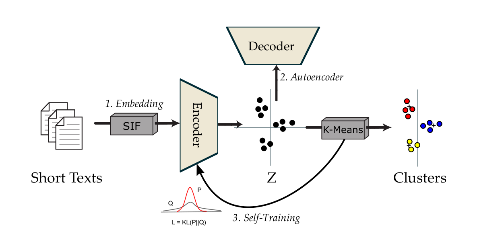
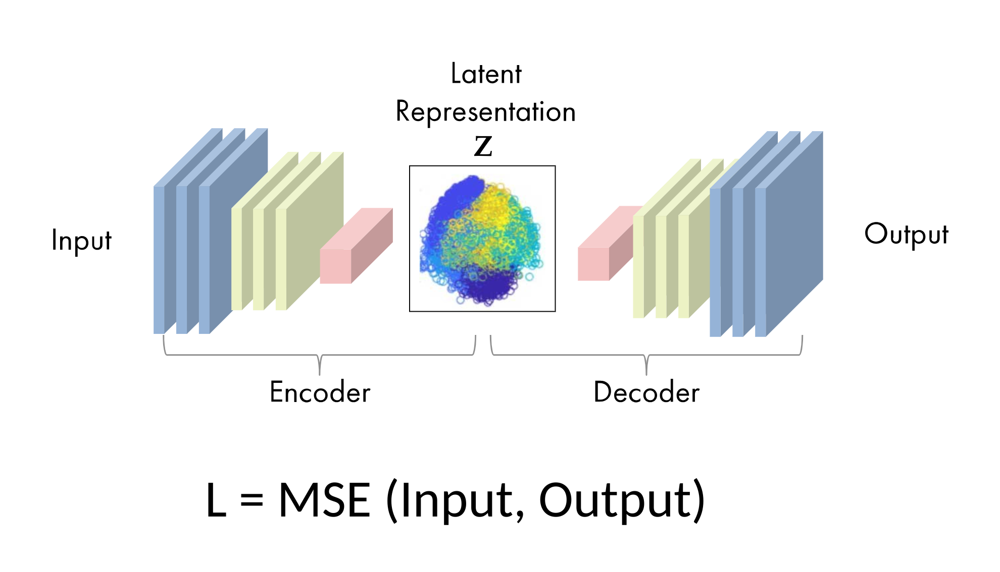
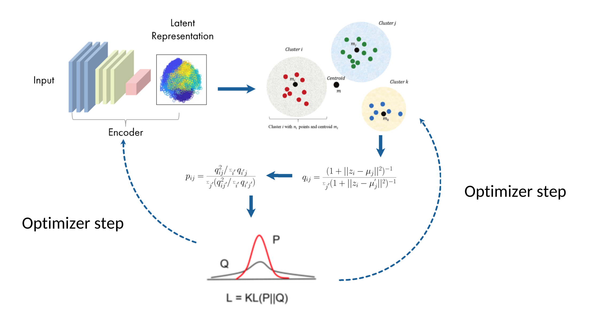
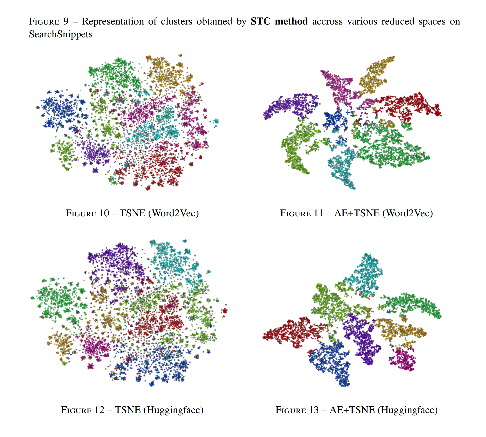

# PyTorch-Short-Text-Clustering
PyTorch version of Self-training approch for short text clustering

### Original Paper: [A Self-Training Approach for Short Text Clustering](https://aclanthology.org/W19-4322/)

# Self-training Steps

### Step 1 - Train autoencoder

The aim of an auto-encoder is to have an output as close as possible to the input. In our study, the mean square error is used to measure the reconstruction loss after data compression and decompression. The autoencoder architecture can be seen in the figure below

### Step 2 - Initialize centroids through KMeans-like clustering​

Initialize cluster centroids involve apply clustering algorithme like K-Means over latent vector space.

### Step 3 - Joint Optimization of Feature Representations and Cluster Assignments through Self-training

Using our cluster centroids, to compute a fuzzy partition of data Q is computed with the following. It's kind of like similarity betweens all data point and centoids in terme of probability distribution.

Then, an auxiliary probability distribution P, stricter is computed that put more emphasis on data points assigned with high confidence, in the aim to improve cluster purity.

# Visualization

# Demo
Follow this [demo](REQUIRED.md) to know how to run scripts.