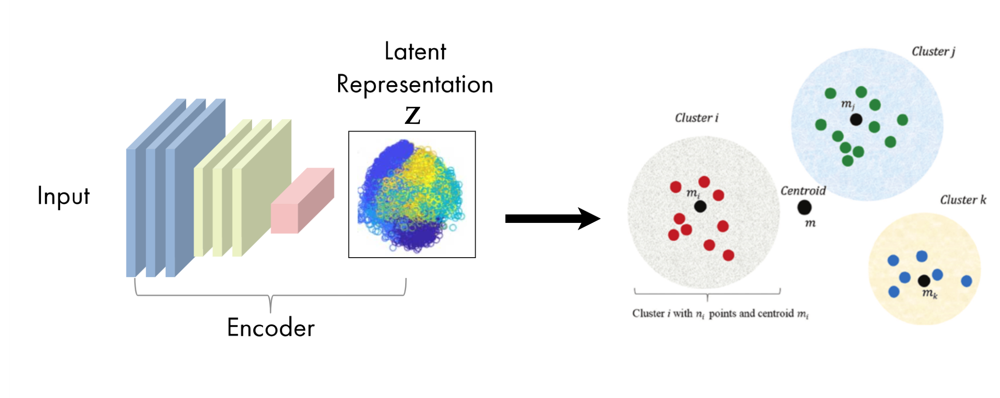

# PyTorch-Short-Text-Clustering
PyTorch version of Self-training approch for short text clustering

### Original Paper: [A Self-Training Approach for Short Text Clustering](https://aclanthology.org/W19-4322/)


# Self-training Steps

### Step 1 - Train autoencoder

The aim of an auto-encoder is to have an output as close as possible to the input. In our study, the mean square error is used to measure the reconstruction loss after data compression and decompression. The autoencoder architecture can be seen in the figure below


### Step 2 - Initialize centroids through KMeans-like clustering​

Initialize cluster centroids involve apply clustering algorithme like K-Means over latent vector space.




### Step 3 - Joint Optimization of Feature Representations and Cluster Assignments through Self-training

Using our cluster centroids, to compute a fuzzy partition of data Q is computed with the following. It's kind of like similarity betweens all data point and centoids in terme of probability distribution.

Then, an auxiliary probability distribution P, stricter is computed that put more emphasis on data points assigned with high confidence, in the aim to improve cluster purity.


# Requires 

## Set up environment
- Using **venv**

Create environement like below.

```
$ python -m venv torchSTC
$ source torchSTC/bin/activate
```

Clone repository and run installation step

```
$ git clone git@github.com:goamegah/torchSTC.git
$ cd torchSTC
$ pip install .
$ python scripts/run.py
```

In this case, if you want to visualize or use PyTorch libraries like *torchinfo*, you need to run the following command instead.

```
$ python -m venv torchSTC
$ source torchSTC/bin/activate
$ git clone git@github.com:goamegah/torchSTC.git
$ cd torchSTC
$ pip install ".[dev, vis]"
$ python scripts/run.py
```

- Using **conda** 

```
$ conda env create --name torchSTC --file env.yaml
$ conda activate torchSTC
$ python scripts/run.py
```

## Get datasets and model checkpoints

To obtain the dataset, first download the ZIP file from the URL "https://papereplbucket.s3.eu-west-3.amazonaws.com/torchstc/datasets.zip" using the requests library. Save the downloaded content as "datasets.zip" locally. Then, use the zipfile library to extract the contents of "datasets.zip" into a directory named 'datasets'. This will make the dataset available for use.

```python
import requests
import zipfile
import io
url = "https://papereplbucket.s3.eu-west-3.amazonaws.com/torchstc/datasets.zip"
response = requests.get(url)
with open("datasets.zip", "wb") as fichier_zip:
  fichier_zip.write(response.content)
with zipfile.ZipFile("datasets.zip", "r") as zip_ref:
  zip_ref.extractall('datasets')
```


# Config file

Before running torchSTC, make sure you choose the correct running configurations. You can change the running configurations by passing keyword arguments to the ```run.py``` file.

```python

$ python run.py --dataset stackoverflow --word_emb Word2Vec --init Kmeans --max_iter 1500

```

# Feature Evaluation

Feature evaluation is done by running Kmeans 5 times and keep average results. 

First, we learned features using **autoencoder** on the ```Stackoverflow``` set. Then, we finetune both autoencoder and cluster centers by frozing decoder part and using Adam as optimizer with default params. Objective function use **KL-divergence** on two distribution: **Q** make by ***soft-assignment*** and an target distribution **P**. After convergence, use run 5 runs clustering algorithm like **Kmeans**.

Check the StackOverflow demo notebook [](https://github.com/goamegah/torchSTC/blob/main/demos/stackoverlow/stc_final_assignment_hgf_sof.ipynb) for reproducibility.
